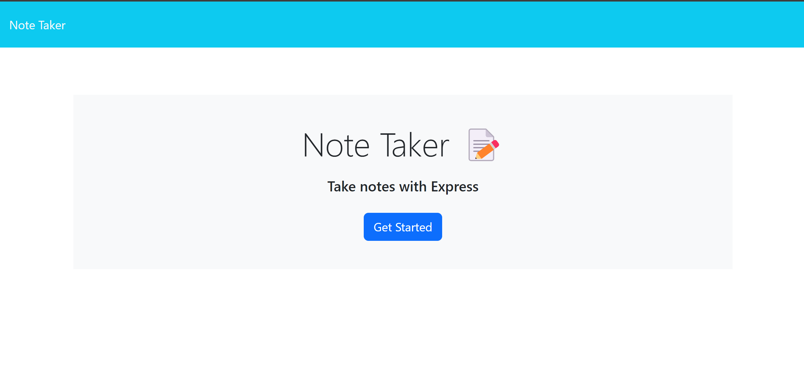
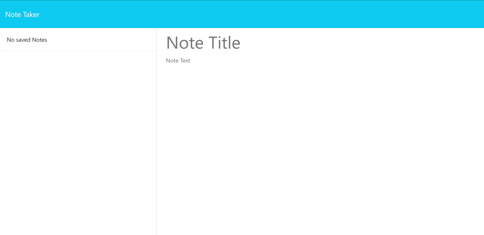
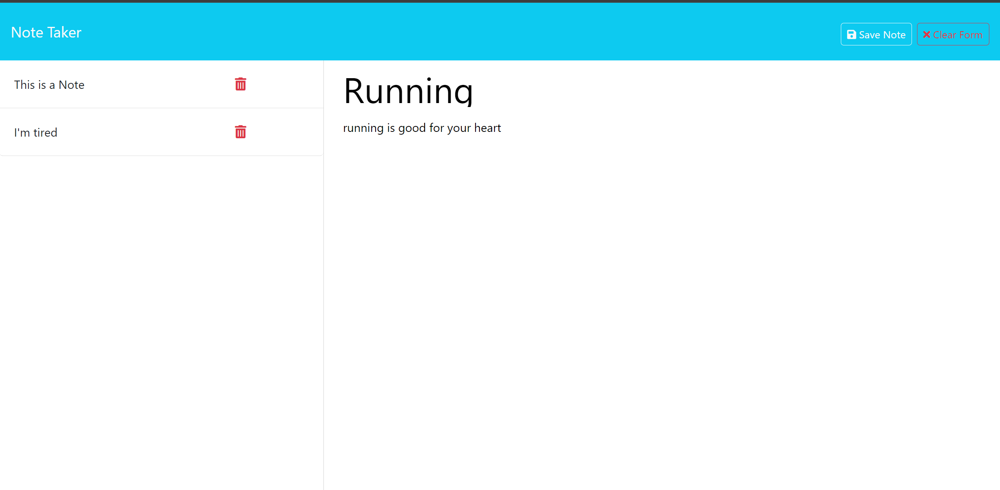

# note-taker-11

Description: This repo was created to showcase a basic note taking site to chronicle your thoughts.

Installation: Install all necessary dependencies by running 'npm i' in your terminal.

Usage: To use this repo, either run node server.js or go to the render link. Once there, you can click the start button and then add and save notes, then click on the saved notes to see them again.

Credits: Josh Stringer

License: Refer to the LICENSE in the repo.

Link To Render Application: https://note-taker-11-osqm.onrender.com

